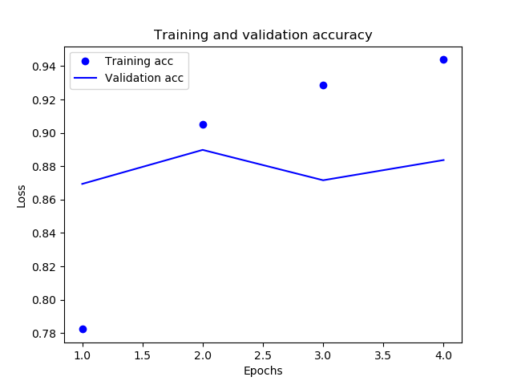
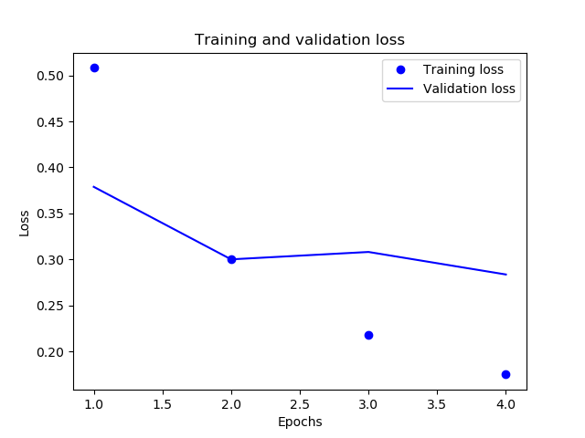

# Naive-Bayes VS MLP

## Resumo
Naive-Bayes é um dos mais rápidos algoritmos de classificação. Possui  
diversas aplicações como detecto de spam, classificação de texto, analise de  
sentimentos e sistemas de recomendação. Esse repositório foi criado com o   
objetivo de avaliar e comparar o desempenho do Naive-Bayes em sua tarefa de  
classificar textos por sentimento. Para isso foi escolhido um conjunto de dados  
presente na biblioteca keras que contem 25 mil reviews do Internet Movie Database (IMDb),  
classificadas como reviews positivas e negativas. Para comparar o desempenho do Naive-Bayes  
foi implementado um Multi Layer Perceptron. Rede que apresentou uma acurácia de 88%.  
Uma performance levemente superior ao Naive-Bayes, que conseguiu 84%.

## DataSet
O conjunto de dados utilizado foi o [IMDB movie reviews sentiment classification](https://keras.io/datasets/#imdb-movie-reviews-sentiment-classification) fornecido pela biblioteca  de deep learning Keras. Esse conjunto dados é formado  
por 25 mil reviews do IMDB, etiquetado pelo sentimento positivo ou negativo.  
Essas reviews vem preprocessadas onde cada review foi codificado com uma  
sequencia de inteiros.


## Multi layer Perceptron

parâmetros utilizados na MLP      | valor
----------------------------------|------
taxa de aprendizado               | 0.001
número de camadas escondidas      | 2
tipo de ativação da 1° camada     | Relu
tipo de ativação da 2° camada     | Relu
número de nós da 1° camada        | 16
número de nós da 2° camada        | 16
tipo de ativação da ultima camada | sigmoide
número de épocas                  | 4
tamanho do batch                  | 512
precisão do modelo                | 88%

### gráficos mostrando sua convergência





**OBS**: foi observado que a partir de **4** épocas  
a rede começava a apresentar overfitting  

### Função ReLU

ReLU
A função ReLU é a unidade linear rectificada. É definida como:

f(x) = max (0, x)

ReLU é a função de ativação mais amplamente utilizada ao projetar redes neurais atualmente. Primeiramente, a função ReLU é não linear, o que significa que podemos facilmente copiar os erros para trás e ter várias camadas de neurônios ativados pela função ReLU.

A principal vantagem de usar a função ReLU sobre outras funções de ativação é que ela não ativa todos os neurônios ao mesmo tempo. O que isto significa ? Se você olhar para a função ReLU e a entrada for negativa, ela será convertida em zero e o neurônio não será ativado. Isso significa que, ao mesmo tempo, apenas alguns neurônios são ativados, tornando a rede esparsa e eficiente e fácil para a computação.

Mas ReLU também pode ter problemas com os gradientes que se deslocam em direção a zero. Mas quando temos um problema, sempre podemos pensar em uma solução. Aliás, isso é o que as empresas mais procuram nos dias de hoje: “resolvedores de problemas”. Seja um e sua empregabilidade estará garantida!  
fonte: [deeplearningbook](http://deeplearningbook.com.br/funcao-de-ativacao/)


## Naive-Bayes

parâmetros utilizados no Naive-Bayes            | valor
------------------------------------------------|------
coeficiente de Laplace/Lidstone                 | 1
aprende a probabilidade a priore das classes ?  | Sim
precisão do modelo                              | 84%


**OBS:** não faço a minima ideia da influência do coeficiente de Laplace/Lidstone  

não  sou capaz de explicar a representação do texto utilizada na avaliação  
Código abaixo:
```python
# 10000 é o número maxímo de palavras em  um review
def vetorize_sequences(sequences,dimension=10000):
    results = np.zeros( (len(sequences),dimension))

    for i, sequence in enumerate(sequences):
        results[i,sequence] = 1 
    
    return results


```

Essa Avaliação foi inpirada no exemplo de classificação binária do livro:  
[Deep Learning with Python](https://www.amazon.com.br/Deep-Learning-Python-Francois-Chollet/dp/1617294438)   
[classifying-movie-reviews](https://github.com/fchollet/deep-learning-with-python-notebooks/blob/master/3.5-classifying-movie-reviews.ipynb)

**OBS:** devido a um bug no carregamento de datasets no keras. A base de dados utilizada está na pasta DataSet, caso queria carrega-lo manualmente.

__dependências desse repositório:__  
numpy  
matplotlib  
keras  
scikit-learn
  
para instalar as dependências:
```shell
pip install numpy  
```
```shell
pip install keras  
```
```shell
pip install matplotlib
```
```shell
pip install scikit-learn
```
